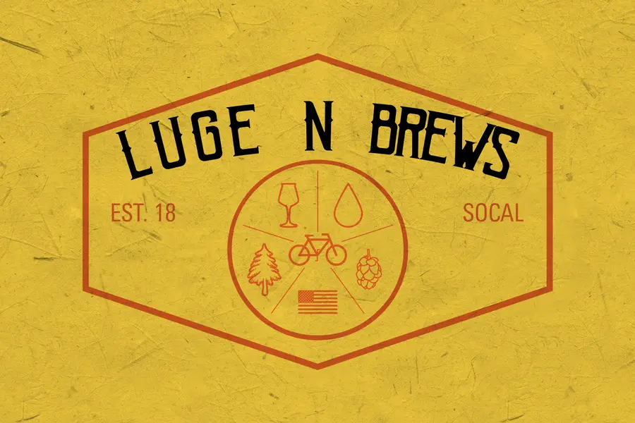
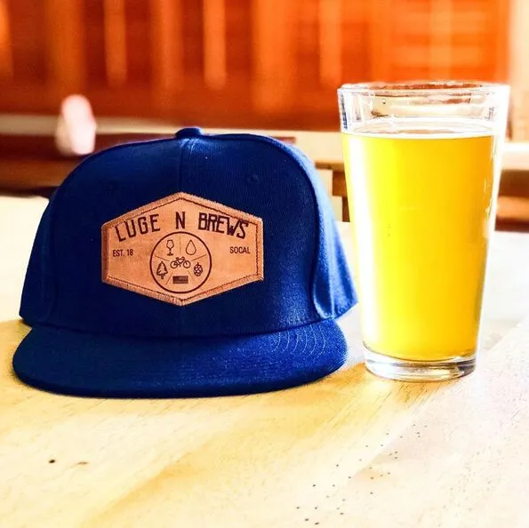
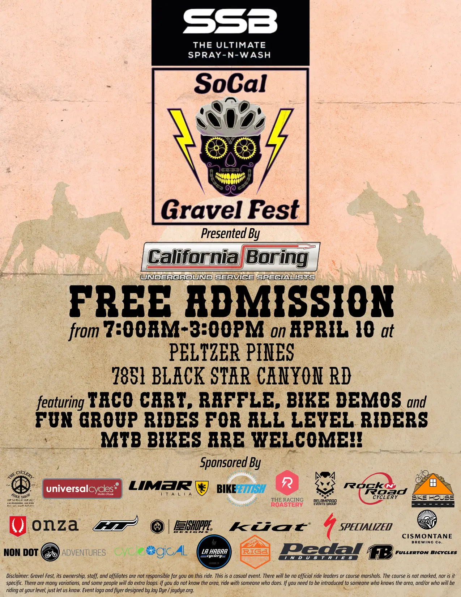
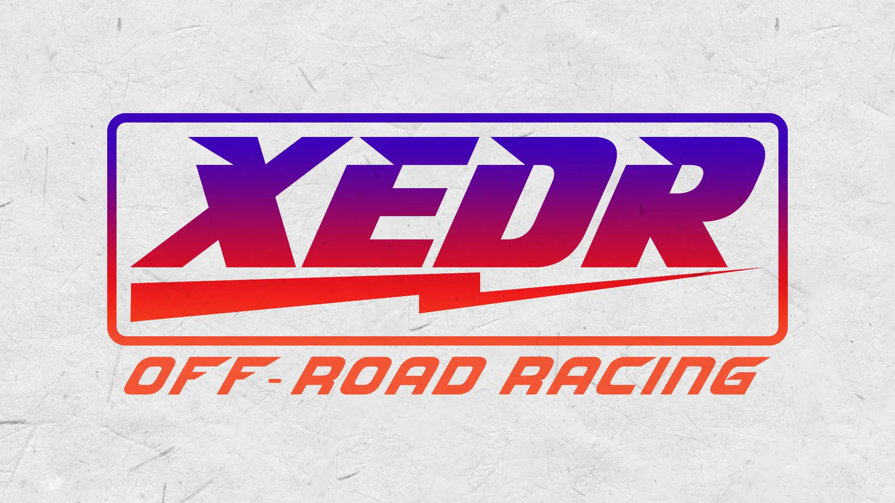
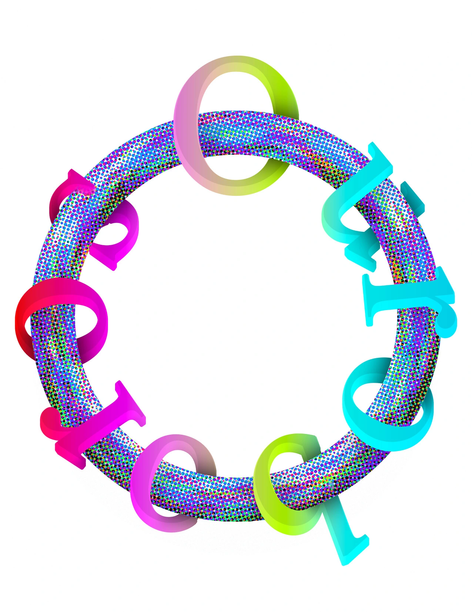

# Design

### Book Design

#### Deer Black Out

<!--- 
 -->

\
[Available from the publisher](https://redhen.org/book/deer-black-out/)

##### Drafts

\

\

\

<blockquote>
Deer Black Out is a(n obsessional re)meditation of violence and trauma through the trans/coalescence of identities surfacing and resurfacing within a manuscript of serialized poetry, influenced by HD, Zukofsky, and Ronald Johnson. It’s sort of like a body, the movement of which you can only recognize emerging within a field of static. Just the outlines. A deer! In ramifying lines, this poetry creates a self-reciprocating dialogue with the very act of self-replication. The language exists as the prosthetic support that co-creates and conditions the Baerself’s emergence into the real. 
</blockquote>

#### Now You Owe Me

\
[Available from the publisher](https://redhen.org/book/now-you-owe-me/)

<blockquote>
Ben and Corinthia spent years abducting college coeds, until one night they took the wrong victim . . .

No one knew witnessing their first murder at seven would propel Ben and his twin toward a killing spree in Pennsylvania. Racked with guilt, they vow to take just one more victim. Too bad they snatched the wrong woman.
</blockquote>

#### Self Portrait of Icarus as a Country on Fire

\
[Available from the publisher](https://redhen.org/book/self-portrait-of-icarus-as-a-country-on-fire/)

<blockquote>
In Self Portrait of Icarus as a Country on Fire, Jason Schneiderman confronts the rise of extremism and antisemitism in the United States while grappling with the end of his marriage and finding his feet as a newly single gay man.

Following up on his landmark collection Hold Me Tight, Jason Schneiderman extends his personal and historical explorations in Self Portrait of Icarus as a Country on Fire. Schneiderman’s signature sense of humor works as a connective tissue across the book, even as the juxtapositions become more unlikely (Kafka and Hillary Clinton?), the historical scope becomes wider, and the personal revelations cut deeper than ever before. These poems represent Schneiderman’s most direct and explicit exploration of Jewish heritage and history, bringing to the surface a theme that has often been missed in his work. The strength of these poems is in their power to trace the wound as a form of healing, to confront the agonizing in order to make way for joy and, yes, love.
</blockquote>

#### My Infinity
##### Drafts

\

\

\

<blockquote>
In her second collection, My Infinity, Didi Jackson continues her exploration of the paradoxical meaning of a world where joy and sorrow simultaneously coexist. These poems investigate both sacred and natural spaces. Her poems move grief and emotional suffering to language as a site of recovery and renewal. Much of this collection is ordered around the work of the Swedish visual artist Hilma af Klint. As the first artist to arguably use abstraction, her radical work brims with enigmatic botanical images painted to grasp the seemingly boundless and hermetic realm of the dead. Similarly, Jackson’s poems explore plant life and natural species in the Green Mountains of Vermont, where perceived thresholds blur in acts of spiritual reimagining. This is a book that questions all that is endless, all that has been thought as limiting, and all that remains unknown.
</blockquote>

### Graphic Design

#### Luge N Brews

\

Luge N Brews is a semi-annual bicycle festival and beer tasting event in Orange County, CA. I designed logos, flyers, and other advertising materials for the festival and related companies and events.

\

\

\

\

\

\

#### Ouroboros

\

Logo design for Chapman's *Ouroboros* literary magazine. Taking the theme of circularity, I drafted a design that emphasized the magazine's print nature and inclusive attitude. 
